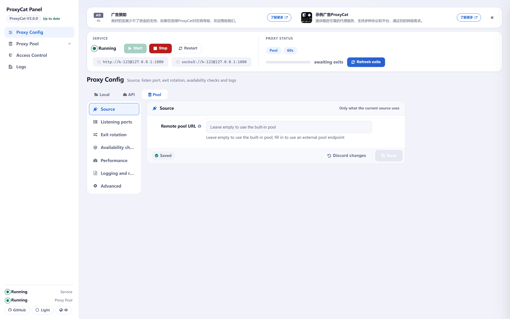
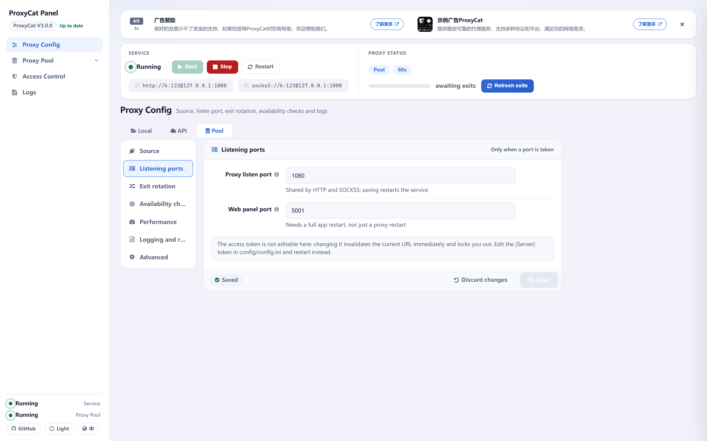
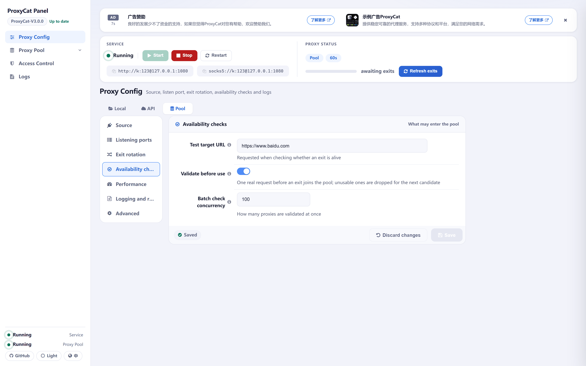
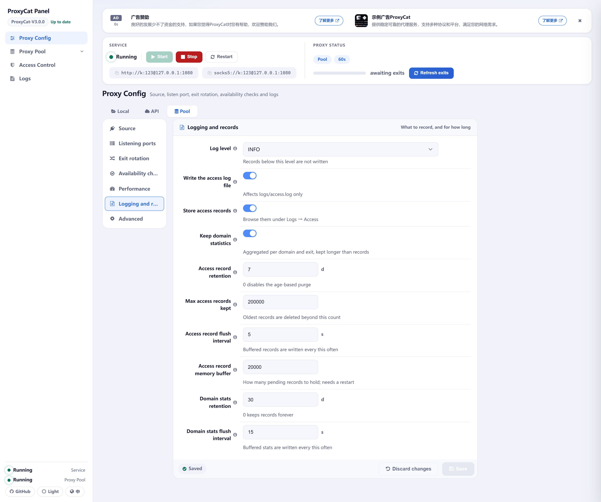
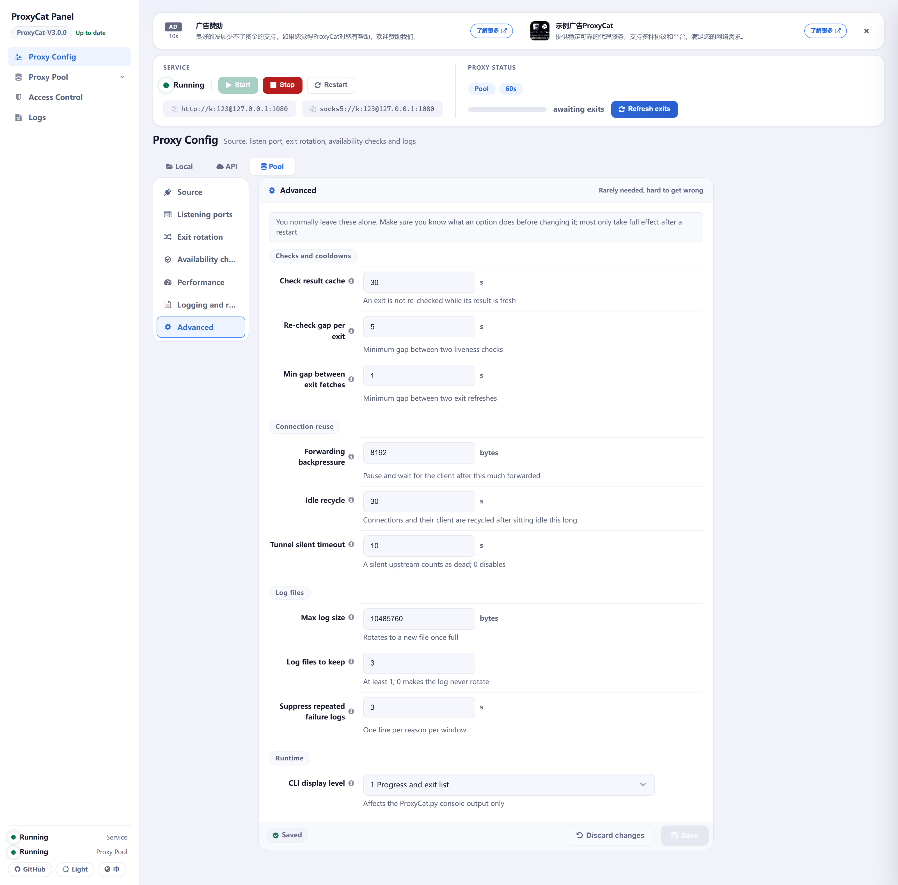
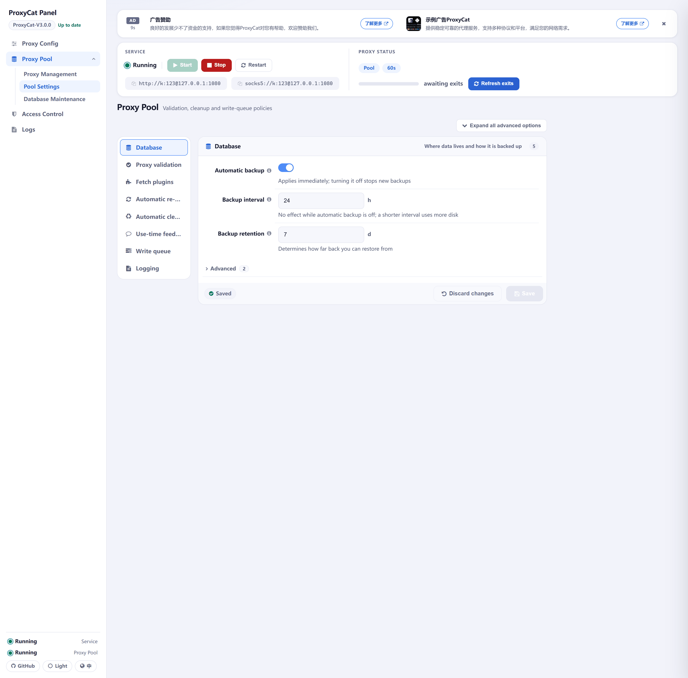
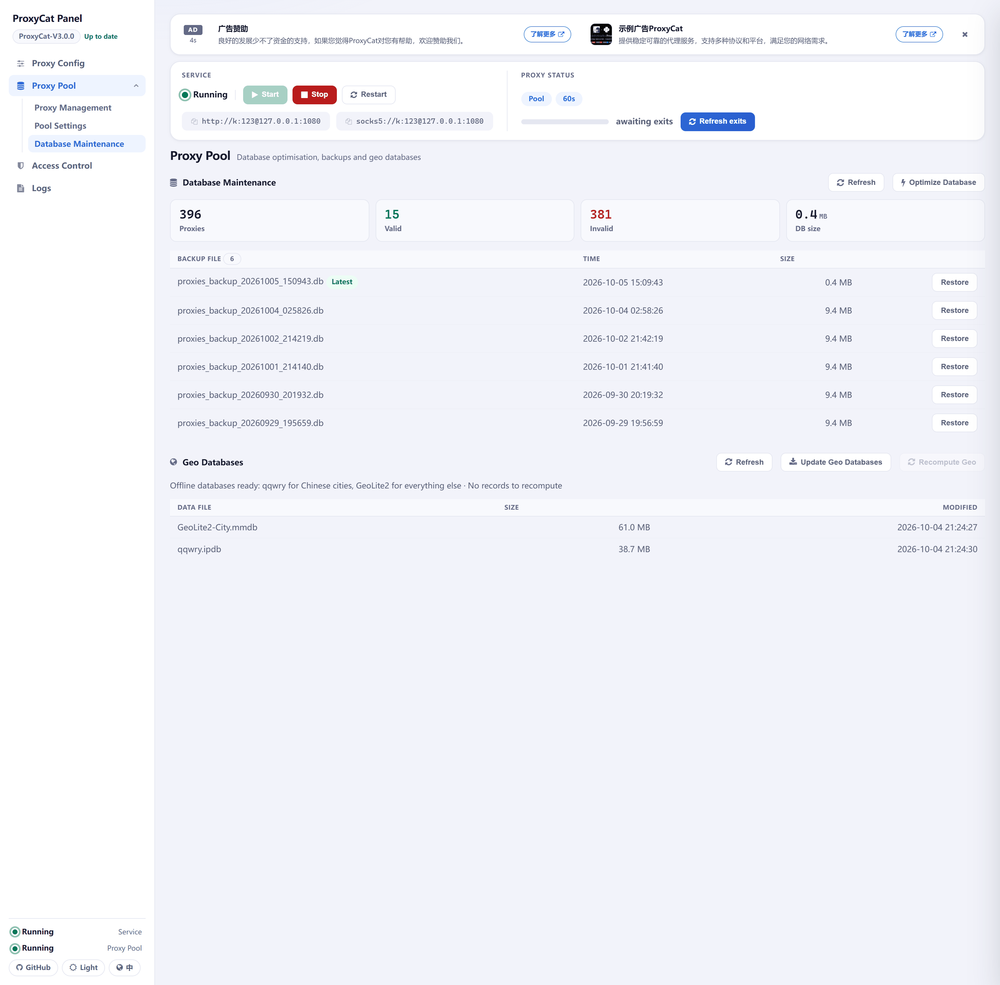

# ProxyCat Configuration Guide

[Back to README](../README-EN.md) | [Features](Features-EN.md) | [Operation Manual](Operation%20Manual-EN.md) | [Investigation Manual](Investigation%20Manual-EN.md) | [Changelog](logs-EN.md) | [API Documentation](../API-EN.md)

## Configuration Files and Authoritative Sources

Configuration is centralized in `config/config.ini`, in four sections:

| Section | Contents |
|---|---|
| `[Server]` | All outbound proxy service parameters: listening ports, rotation mode and interval, proxy source, authentication, access list files, logging and statistics switches |
| `[Users]` | Basic authentication accounts for the outbound proxy |
| `[api_credentials]` | Multiple credential sets for upstream proxy endpoints; the set in effect can be switched from the panel |
| `[Pool]` | All proxy pool parameters, with dotted key names (e.g. `validator.timeout_seconds`) |

The panel's settings forms use the same grouping: the common `[Server]` options are visible directly in the seven groups under Proxy Config, while tuning items that require understanding the internals are collected in the Advanced group; the `[Pool]` settings form folds advanced items inside each group, and the panel remembers the group you last viewed.

**There are three authorities, in order of precedence:**

1. **The panel forms** (Proxy Config and Pool Settings) — validated, applied on save, recommended for daily use.
2. **The inline comments in `config.ini`** — the most complete, one Chinese sentence per key.
3. **`GET /api/pool/schema`** — the machine-readable form of the `[Pool]` section (the panel's Pool Settings form is rendered from it).

Some of these options directly determine which external addresses the program sends requests to (e.g. `test_url`, `api_proxy_url`, `pool_remote_url`, `version_check_url`, `validator.*_apis`, `validator.host_public_ip`); for the full list see [Outbound Network Requests](Features-EN.md#outbound-network-requests).

> Note: the comments inside `config.ini` are in **Chinese**; only the panel's field descriptions are rendered per language.

The **Default** column in this page's tables means the **built-in program default** (the value used when a key is missing or the whole `config.ini` is deleted). The `config.ini` shipped in the repo has been tuned by the author, and the following options differ from the built-in defaults:

| Option | Built-in default | Shipped `config.ini` |
|---|---|---|
| `proxy_source_mode` | `local` | `pool` |
| `api_proxy_url` | `http://example.com/getip` | empty |
| `mode` | `cycle` | `request` |
| `interval` | `300` | `60` |
| `exit_count` | `5` | `10` |
| `exit_wait_timeout` | `15` | `30` |
| `max_concurrent_requests` | `1000` | `3000` |
| `check_concurrency` | `50` | `100` |
| `switch_cooldown` | `2` | `1` |
| `proxy_check_ttl` | `60` | `30` |
| `check_cooldown` | `10` | `5` |
| `access_records_real_ip_probe` | `false` | `true` |
| `token` | empty (the panel does not authenticate) | `honmashironeko`, must be changed before exposing it |

> When started with the `config.ini` shipped in the repo, the source is `pool` and no `pool_remote_url` is configured, so **the built-in proxy pool starts together with the service automatically** — this is the normal behaviour of the shipped configuration, not a fault.

The shipped values of the `[Pool]` section match the built-in defaults; both sides are the same configuration.

## How Changes Take Effect

| Mechanism | Applies to | Notes |
|---|---|---|
| Immediately | the vast majority of `[Server]` and `[Pool]` options | Applies at once when saved from the panel; a hand-edited `config.ini` is hot-reloaded once the background watcher notices it |
| Needs a proxy service restart | `port` | The port is bound only when the service starts; the process does not have to be touched — restarting the proxy service once from the panel rebinds it to the new port |
| Needs a full application restart | `web_port`, `log_max_bytes`, `log_backup_count` | The web port is bound at application startup, and the log rotation parameters are fixed when the log handlers are assembled at startup; restarting only the proxy service is not enough |
| Needs a pool service or service restart | `database.path`, `database.pool_max_readers` (pool service); `write_queue.max_queue_size` (service); `access_records_buffer_size` (when lowered) | The resource is fixed when it is created; changing it halfway either has no effect or loses the data already queued |

**Hot-reload boundaries** (easy to get wrong):

- **Configuration saved from the panel applies immediately**, on both entry points.
- **When you hand-edit `config.ini`**, both entry points reload the `[Server]` section: `app.py` has a background thread polling the file every second — about 1 second; `ProxyCat.py` notices the change in its status polling loop and reloads within about 1 second in countdown mode, or up to about 5 seconds under `loadbalance` or non-time-based rotation (`interval` is `0`).
- The `[Pool]` section is hot-reloaded too, taking effect within about 3 seconds on both entry points.
- `port` and `web_port` are bound only when the service starts: `web_port` must be followed by a full application restart (the panel only warns on save); `port` needs no process restart — restarting the proxy service once from the panel applies the new port.

So **there is no such thing as "every configuration change needs a restart"** — only startup-bound options such as `port` and `web_port` need one; every other option, whether saved from the panel or hand-edited in `config.ini`, takes effect through the hot reload described above.

## `[Server]` Options

On the panel's Proxy Config page the `[Server]` section is split by purpose into seven groups; the keys are listed below in the same groups, with how each option applies in the last column.

### Source

Only the fields the current source uses are shown.

The panel's Proxy Config → Source group: the buttons at the top switch the proxy source, and the form renders only the fields the current source uses.

| Option | Default | Description | Applies |
|---|---|---|---|
| `proxy_source_mode` | `local` | Proxy source: `local` reads `proxy_file`; `api` fetches `api_proxy_url`; `pool` uses the proxy pool. The shipped `config.ini` uses `pool` | Immediately |
| `proxy_file` | `ip.txt` | File name of the proxy list for the `local` source; only the file name is used (any path part is ignored) and it is always read from the `config/` directory; saving the local proxy list from the panel writes back to this file | Immediately |
| `api_proxy_url` | `http://example.com/getip` | Endpoint the `api` source fetches proxy addresses from. The response is parsed line by line: one proxy address per line, a line with no protocol is treated as http, and lines with an invalid format are skipped | Immediately |
| `proxy_username` | empty | Authentication account appended to fetched proxy addresses; it takes effect only when `proxy_password` is non-empty as well, and it is not used to authenticate to the endpoint itself (`api_proxy_url`) | Immediately |
| `proxy_password` | empty | Used as a pair with `proxy_username`; authentication is attached to fetched addresses only when both are non-empty | Immediately |
| `pool_remote_url` | empty | The **fetch** endpoint of an external proxy pool: ProxyCat issues a single GET and parses every line of the response body into a proxy address, performing no management operations; `404` means no proxy is available at the moment. Empty means the in-process pool is used | Immediately |

### Listening Ports

Only needed when a port is taken.

The panel's Proxy Config → Listening ports group, with an extra note: the access token is not changed here.

| Option | Default | Description | Applies |
|---|---|---|---|
| `port` | `1080` | Proxy listening port, shared by HTTP and SOCKS5 (1-65535) | Needs a proxy service restart |
| `web_port` | `5001` | Web panel port (1-65535); changing it requires restarting the whole application, not just the proxy service | Needs a full application restart |
| `token` | empty | Web panel access token, validated through `?token=`; empty means the panel does not authenticate. The panel has **no** field for this — changing it invalidates the current URL at once and locks you out of the panel, so to replace it, edit `config.ini` and save | Hot-reloads after the file is saved (about 1 second); the old token stops working right away |

> **Risk of an empty `token`**: with it empty, anyone who can reach the panel port can read and write configuration, view access records and obtain the upstream credentials. The panel is meant to be used locally by default; if you expose it to a network, be sure to set a `token`.
> Also, **the `config.ini` shipped in this repo carries a public default token** — change it before exposing the panel.

### Exit Rotation

How long an exit serves, and how many serve at once.

The panel's Proxy Config → Exit rotation group: the run mode, the two lifetime measures, how many exits are in use, and how long a request queues when no exit is available.

| Option | Default | Description | Applies |
|---|---|---|---|
| `mode` | `cycle` | **The same key asks two different questions depending on the source.** For the `local` source it asks *which one to pick*: `cycle` works down the list in order (ignoring load — the next entry is used only once the previous one is full); `loadbalance` picks whichever exit is under the least pressure. For the `api` / `pool` sources it asks *when to rotate*: `request` (On request) — it only fetches and swaps exits when a new task arrives, and with no tasks at all expired exits are removed outright and the pool drains, until the next request fetches a fresh set to fill it; `continuous` (Continuous) — regardless of traffic, the background proactively replaces expired exits and refills to the target. When the source is switched and the current value does not belong to the new group, it is normalised to that group's default (the first item in the list): the first item of the `api` / `pool` group is `request` (which likewise comes first in the panel's dropdown), and the first item of the `local` group is `cycle` | Immediately |
| `interval` | `300` | Lifetime cap of each exit (seconds): once it has been in the roster that long it is replaced. Each exit times itself (that is, "its own arrival + `interval`", so a batch that entered together expires together), and **all** expired exits are replaced at once — not a single swap every so often. It applies to every source and all four run modes (the local source rotates by lifetime too, taking the next entry from the file; with no spare entry in the file, the exit restarts its lifetime in place). **When** the swap happens is decided by the run mode: `continuous` swaps in the background on its own, while `request` swaps only when a new task arrives and simply removes expired exits while idle. It and `request_interval` are **two independent rules that both apply**: set both and whichever comes first wins — it is not either/or. `0` disables time-based replacement | Immediately |
| `request_interval` | `0` | Lifetime cap of each exit measured in assignments (replaced after being handed out this many times): again each exit counts its own. What is counted is "assignments" — a request that uses it counts once, and a retry that lands on a different exit counts once there. It and `interval` both apply, and whichever comes first wins. `0` disables request-count-based replacement | Immediately |
| `exit_count` | `5` | The target capacity of the exit pool: this many upstream exits are kept in use — under `continuous` it **stays full even while there are no requests**; `request` (the shipped value) and the `local` source are request-driven instead: after about 10 idle seconds no more restocking happens, expired exits are removed rather than replaced and the pool may drain, and the next request fetches a fresh set to fill it (an empty pool or a gap left standing means the next request has to wait on the request path for one fetch plus validation). Fetched candidates are validated concurrently and fill the slots one by one until full; when an exit dies, only that one is replaced, not the whole batch. For `api` / `pool`, every fetch over-fetches by the shortfall, `min(shortfall × 8, 24)`; lines an `api` endpoint returns beyond that cap are truncated and discarded. `local` uses the file itself as the source, with this value as its cap (fewer entries means that is how many are used). Lowering it recalls the surplus on the spot (no waiting for lifetimes); each exit holds one client, so watch the connection and memory cost of a very large value. The shipped `config.ini` uses `10` | Immediately |
| `exit_wait_timeout` | `15` | How long a request queues (seconds) when there is no usable exit at all (a fresh start, a source switch, every exit disabled, a failed fetch); it is served as usual once an exit arrives, and only gets a `503` after the wait runs out. `0` means do not wait — return `503` on the spot | Immediately |

### Availability Checks

What may enter the pool.

The panel's Proxy Config → Availability checks group: the check target, startup checking and pre-use validation, and the batch check concurrency.

| Option | Default | Description | Applies |
|---|---|---|---|
| `test_url` | `https://www.baidu.com` | Target URL for proxy liveness checks; the pool's `validator.target_url` is derived from it as well (Pool Settings has no such field — changing it here is changing the pool's validation target) | Immediately |
| `check_proxies_on_startup` | `true` | Whether to check proxy availability once at startup. When the service starts with the `local` source (either entry point counts), a full check of the current roster also runs: unreachable entries are **removed one by one**, and the gaps are left to the refill. The "Check proxies" button on the panel checks the **source list** (every entry in `ip.txt`), not the current roster | Immediately |
| `check_proxies_on_use` | `true` | Whether to validate a candidate (one real request) before it fills an exit slot; a failed one is discarded and the next is tried. **It is not a per-request check**: an exit that dies while serving is caught by failure retirement. Addresses from a source can expire within a minute — an open port does not mean the proxy still works | Immediately |
| `check_concurrency` | `50` | Concurrency cap for batch proxy checks (1-1000). The shipped `config.ini` uses `100` | Immediately |

### Performance

How much this host can carry at once.

The panel's Proxy Config → Performance group: global concurrency, per-exit concurrency, and the auto-expansion switch.

| Option | Default | Description | Applies |
|---|---|---|---|
| `max_concurrent_requests` | `1000` | Cap on requests handled simultaneously; beyond it requests queue on the semaphore. It is the global semaphore, applied alike to all three request kinds, and sized in **tunnels** rather than requests — when the sum of per-exit quotas far exceeds it, this is the value that actually applies. The shipped `config.ini` uses `3000` | Immediately |
| `max_concurrent_per_proxy` | `0` | Cap on active connections through a single upstream exit; `0` means unlimited. It counts connections "in use": a request counts while it is being forwarded, and a tunnel counts after establishment only while it is actually relaying data — idle tunnels do not consume quota (so it is an **admission control**, not a hard ceiling on the number of open upstream connections). Total upstream concurrency ≈ exits × this value (capped by the global limit). When your upstream rate-limits by exit IP, set it to what a single IP can bear (say 20); the excess queues instead of knocking the upstream over | Immediately |
| `auto_expand_enabled` | `true` | Auto-expands the exit pool under load, with two trigger paths: (1) **immediate** — when the connections currently held on the listening port exceed "exits in use × per-exit quota", the exit count is doubled on the spot (capped at 2×) and filled in one go, without waiting for the watermark; (2) **fallback** — the background adds exits one step at a time based on "the share of exits pinned at their per-exit quota" (80% sustained for 1 second). Release looks at pool-wide utilisation (below half for 30 seconds); the thresholds and durations are fixed in code and not configurable. The per-exit quota is relaxed (at most doubled) only when this round did fetch from the source, got an answer, and still has no usable new candidate; the roster ceiling is `max(exit_count, min(exit_count × 2, max_concurrent_requests))`. After expansion stops, the surplus exits **serve out their own lifetimes** before being retired one by one. With `max_concurrent_per_proxy` at `0` (unlimited) nothing expands, but an expansion already open is still released as usual | Immediately |

### Logging and Records

What to record, and for how long.

The panel's Proxy Config → Logging and records group: the log level, the three sets of switches for the access log, access records and domain statistics, and their respective retention rules.

| Option | Default | Description | Applies |
|---|---|---|---|
| `log_level` | `INFO` | Log level: `DEBUG` / `INFO` / `WARNING` / `ERROR` / `CRITICAL`. Successful access lines are `INFO`, so setting the level to `WARNING` or above filters them out (the panel warns you in place) | Immediately |
| `log_access_enabled` | `true` | Whether to write every proxied access to the access log (`logs/access.log`). Turning it off stops writing that file; domain statistics and access record details are both unaffected | Immediately |
| `access_records_enabled` | `true` | Whether to record every proxy request individually (the access details on the panel's Logs page, stored in `logs/access_records.db`). It is a destination independent of the access log file and domain statistics, and the switches do not affect each other | Immediately |
| `access_records_real_ip_probe` | `false` | When the exit address is a gateway, probe the real egress IP through it once (only for the `api` source; each address costs one extra unit of proxied traffic). The pool source uses the exit IP already verified in the pool, and local proxies are not probed. The shipped `config.ini` uses `true` | Immediately |
| `domain_stats_enabled` | `true` | Whether to accumulate access statistics per "domain × upstream proxy" (the access statistics on the panel's Logs page) | Immediately |
| `access_records_retention_days` | `7` | Retention in days for access records; `0` means no time-based cleanup | Immediately |
| `access_records_max_rows` | `200000` | Row cap for access records; rows beyond it are trimmed from the oldest; `0` means no limit | Immediately |
| `access_records_flush_interval` | `5` | How often access records are flushed to the database (seconds) | Immediately |
| `access_records_buffer_size` | `20000` | In-memory buffer size for access records; beyond it the oldest are dropped and counted. Lowering it requires a restart | Restart needed when lowered |
| `domain_stats_retention_days` | `30` | Retention in days for access statistics; `0` means no cleanup | Immediately |
| `domain_stats_flush_interval` | `15` | How often access statistics are flushed to the database (seconds) | Immediately |

### Advanced

Normally left alone; a mistake here is hard to trace.

The panel's Proxy Config → Advanced group: the cooldowns, caching and internal-mechanism tuning items all live here.

| Option | Default | Description | Applies |
|---|---|---|---|
| `proxy_check_ttl` | `60` | Cache lifetime of proxy availability check results (seconds). The shipped `config.ini` uses `30` | Immediately |
| `check_cooldown` | `10` | Cooldown between two availability checks (seconds). The shipped `config.ini` uses `5` | Immediately |
| `switch_cooldown` | `2` | Cooldown after a batch refetch of exits (seconds); no refetch during the cooldown (refills are rate-limited by it too). It applies to all three sources alike. The shipped `config.ini` uses `1` | Immediately |
| `buffer_size` | `8192` | How many bytes of plaintext HTTP forwarding accumulate before backpressure is applied once (waiting for the client to drain the data); minimum 1024. It **does not control chunk size** — response bodies are forwarded in the upstream's native chunks (usually 64 KiB) with no re-chunking; the tunnel relay is fixed at 64 KiB and is unaffected by this option | Immediately |
| `client_keepalive_expiry` | `30` | Idle recycling (seconds): a keep-alive connection expires after being idle this long, and the clients holding those connections are recycled on the same clock (it should not outlive its connections). Lowering it discards freshly warmed connections and degrades connection reuse | Immediately |
| `tunnel_idle_timeout` | `10` | After a tunnel is established, how long "the client has sent data and the upstream has not returned a single byte" lasts before the upstream is declared dead (seconds); `0` disables the check. It is the **only way** to catch an upstream that accepts CONNECT and then sends nothing back, but an upstream that is merely very slow to queue can trip it too — if upstreams routinely take longer than this under high concurrency, raise it | Immediately |
| `log_max_bytes` | `10485760` | Size cap of a single log file (bytes); it rotates beyond it | Needs a full application restart |
| `log_backup_count` | `3` | Number of historical files kept after rotation; at least 1 (`0` would make logs never rotate) | Needs a full application restart |
| `proxy_failure_cooldown` | `3` | Folding window for failure warnings (seconds): warnings of the same kind are written to the log once per window, with a record of how many were folded. Under high concurrency failures arrive in batches — without folding, one sentence would flood the log. Folding **happens at the log layer only**; an exit's accounting and scheduling are unaffected (they look at the recent failure share, not a timer) | Immediately |
| `display_level` | `1` | Console verbosity: `0` shows only exit roster changes and error messages, `1` shows the exit roster with per-exit state and the countdown, `2` shows all detailed information (the behaviour of `2` and `3` is identical item by item, and a `3` is normalised to `2`); `2` appends an explanation of each level after the startup banner. It only affects output when running the `ProxyCat.py` command-line entry | Immediately (affects only the command-line entry's output) |
| `version_check_url` | empty | The source address for the version check. When **empty**, three built-in addresses are requested concurrently (the official `releases.atom`, the `gh-proxy.com` mirror and the official API) and the first usable version number wins; when **set**, that address is the only source and the three built-ins are not requested. It may be a GitHub API, a `releases.atom` or any page a version number can be parsed out of, and must be a full http/https URL (otherwise the save is rejected). Note that the built-in third-party mirror sees your request IP and may return a cached, older version, and that the unauthenticated official API allows 60 requests per hour per IP | Immediately (used by the next check) |

### Access Control and UI Language

These keys are not among the seven groups on the Proxy Config page: the whitelist, blacklist and bypass list are set on the panel's Access Control page, and the language switch sits at the bottom of the sidebar.

| Option | Default | Description | Applies |
|---|---|---|---|
| `whitelist_file` | `whitelist.txt` | Client IP whitelist file name; only the file name is used, and it is always read from the `config/` directory | Immediately |
| `blacklist_file` | `blacklist.txt` | Client IP blacklist file name; only the file name is used, and it is always read from the `config/` directory | Immediately |
| `ip_auth_priority` | `whitelist` | Which side wins when a client matches both lists: `whitelist` (allow) / `blacklist` (block) | Immediately |
| `bypass_whitelist_file` | `bypass_whitelist.txt` | Bypass list file name: matching target addresses connect directly, bypassing the upstream proxy (wildcards supported), with no blocking decision; only the file name is used, and it is always read from the `config/` directory | Immediately |
| `language` | `cn` | UI and message language: `cn` / `en`. The language is a **server-side setting** (written back to `config.ini`): switching it changes the panel text, API error messages and exported file headers together; the command-line entry's console banner is printed once at startup and is not reprinted | Immediately |

## `[Users]`

The Basic authentication account table for the outbound proxy: the key is the username and the value is the password, one account per line; an empty section means the proxy requires no authentication.

| Option | Default | Description | Applies |
|---|---|---|---|
| `username = password` (e.g. `neko = 123456`) | the built-in defaults have no `[Users]` section, so no authentication is required | Requests must carry Basic authentication; a request without it gets a `407`. The `config.ini` shipped in this repo has two accounts: `k = 123` and `neko = 123456` | Applied immediately when saved from Access Control → User Management |

Maintaining it through the panel's User Management is recommended — saving from the panel updates the running service directly; hand-editing this section is also read in through the configuration hot reload.

## `[api_credentials]`

Multiple credential sets for upstream proxy endpoints, maintained from the credential management under Proxy Config → Source (API source) in the panel, where the active set can be switched in one click.

| Option | Default | Description | Applies |
|---|---|---|---|
| `credential_sets` | `[]` | Available credential sets for fetching IPs, a JSON array whose items are `{"name", "url", "username", "password"}`; if you edit this line by hand it must stay valid JSON, otherwise the whole set of credentials cannot be read | Applied immediately when saved from the panel |
| `active_credential` | empty | Name of the credential currently in effect; it must match the `name` of an item in `credential_sets` exactly — a mismatch counts as none selected | Applied immediately when saved from the panel |

## `[Pool]` Options

Keys in the `[Pool]` section use dotted names. Saving a change applies it hot without a restart; you can also edit them from the panel's Proxy Pool → Pool Settings page — both sides are the same configuration. The groups below follow the same order as the Pool Settings page, driven by `GET /api/pool/schema`.

The panel's Proxy Pool → Pool Settings page: the forms of all eight groups below live on this one page.

### Database

Where the data is stored and how it is backed up.

The panel's Proxy Pool → Database Maintenance page: database statistics and optimization, the backup list and restore, and offline geolocation database updates and recomputation.

| Option | Default | Description | Applies |
|---|---|---|---|
| `database.path` | `data/proxies.db` | File holding all pool data (SQLite format). A relative path is resolved from the `modules/proxypool/` directory. The database is already open at startup | Needs a pool service restart |
| `database.pool_max_readers` | `4` | Cap on connections querying the database at once; writes always take exactly 1 connection. Raising it makes concurrent queries smoother at the cost of some file handles; keep the default when the pool is small | Needs a pool service restart |
| `database.backup_enabled` | `true` | Whether to back up the database automatically at the interval below; it takes effect as soon as it is saved (turning it off stops the backups, turning it back on starts them) | Immediately |
| `database.backup_interval_hours` | `24` | Interval between automatic backups (hours) | Immediately |
| `database.backup_retention_days` | `7` | How many days backup files are kept before being deleted automatically | Immediately |

### Proxy Validation

What counts as a usable proxy.

| Option | Default | Description | Applies |
|---|---|---|---|
| `validator.check_anonymity` | `true` | Whether to check proxy anonymity. Anonymity is judged by the request headers the target actually received, which can only be measured with one plaintext request through the proxy; turning it off stops those requests and stops judging anonymity, while levels already measured are kept as they are | Immediately |
| `validator.host_public_ip` | empty | This host's public egress IP, the reference for judging a "transparent proxy". On a dual-stack host, fill in one per family separated by a comma (at most one IPv4 and one IPv6); both families take part in the comparison, and a single value works too. When it is empty, ProxyCat fetches it by reaching an IP-check site **without going through the proxy** (at most once every 30 minutes; both success and failure restart the timer); filling in your own egress IP removes that external request entirely. When it is empty or cannot be obtained, anonymity cannot be judged and that field keeps its previous value | Immediately |
| `validator.timeout_seconds` | `5` | How many seconds one proxy validation may take before it is judged unusable. All probe requests obey this cap | Immediately |
| `validator.connect_timeout_seconds` | `2.0` | How many seconds connecting to a proxy may take. Dead proxies mostly stall at the connection step, so lowering it noticeably speeds up a whole validation batch; `0` means no separate limit — only the overall timeout above applies | Immediately |
| `validator.max_concurrent` | `400` | How many proxies to validate at once. Every validation connects to a different host, so it is safe to raise; it also sets this machine's connection-pool ceiling and open-socket budget (one validation fires a dozen-odd requests concurrently), so lower it on a constrained host, and lower it a little if the test sites start rate-limiting (visible as a flood of sudden proxy timeouts). Note also that queueing timeouts during the **liveness probe** count as "no conclusion" and write no field, whereas identity and plaintext probes fired concurrently after liveness passes are, if they time out in the local connection-pool queue, recorded as a failed sample and drag down the success-rate dimension of the health score — so higher is not always better | Immediately |
| `validator.identity_echo_apis` | `https://httpbin.org/anything, https://httpbingo.org/anything, https://eu.httpbin.org/anything` | Endpoints used to probe the egress IP and anonymity, separated by commas; they must be https. Such an endpoint must return `origin` and `headers`, so a single request yields the egress IP, anonymity and HTTPS support at once. Unreachable ones are skipped automatically; the usable ones are raced one by one in order of direct-connection latency, without truncating by count — any extras stay as substitutes | Immediately |
| `validator.plain_identity_echo_apis` | `http://postman-echo.com/get` | Supplementary plaintext echo endpoints, separated by commas; they must be http. Anonymity is judged by "which request headers the target actually received", and the plaintext path is its standard observation surface — the defaults are the plaintext addresses of the endpoints above. If the proxies cannot reach those sites and anonymity keeps being judged as the fallback tier, put echo sites the proxies can reach here | Immediately |
| `validator.ip_check_apis` | `https://icanhazip.com, https://checkip.amazonaws.com, https://api.ip.sb/ip, https://realip.cc/simple, https://httpbin.org/ip, https://api.ipify.org, https://ipinfo.io/json, https://ipwho.is/, https://www.cloudflare.com/cdn-cgi/trace` | IP-only endpoints, separated by commas; they must be https. They are the fallback when none of the endpoints above produces a result, and are likewise raced one by one by direct-connection latency, without truncating by count | Immediately |

### Fetch Plugins

How often each source is scraped.

| Option | Default | Description | Applies |
|---|---|---|---|
| `plugins.scan_interval_seconds` | `60` | How often to check whether any plugin is due for a fetch (seconds). It only sets the checking frequency, and does not change each plugin's own fetch interval | Immediately |
| `plugins.default_interval_minutes` | `60` | Default fetch interval for new plugins (minutes). Every plugin can adjust its own interval; this option only affects plugins created later | Immediately |
| `plugins.execution_timeout_seconds` | `300` | How many seconds a single plugin run may take before it is interrupted | Immediately |
| `plugins.request_timeout_seconds` | `30` | How many seconds a plugin waits for one web request; when a target site is unreachable, that is how long it waits | Immediately |
| `plugins.max_parallel_plugins` | `3` | How many plugins may run at the same time | Immediately |
| `plugins.max_retries_on_failure` | `2` | How many extra attempts a failed plugin fetch gets. `2` means at most 3 attempts in total | Immediately |
| `plugins.retry_base_delay_seconds` | `10.0` | Seconds to wait before retrying after a plugin failure. The wait doubles with each further attempt (1× before the first retry, 2× before the second, 4× before the third), so the same site is not hammered again in quick succession | Immediately |

### Automatic Re-validation

How dead proxies are found.

| Option | Default | Description | Applies |
|---|---|---|---|
| `auto_revalidation.enabled` | `true` | Whether stored proxies are re-checked periodically for liveness | Immediately |
| `auto_revalidation.interval_minutes` | `360` | Default re-check interval (minutes). Each plugin can set its own interval in Plugin Management | Immediately |
| `auto_revalidation.only_valid_proxies` | `true` | Check only currently valid proxies, skipping ones already judged invalid | Immediately |
| `auto_revalidation.run_on_start` | `true` | Run a check right after startup instead of waiting a full interval | Immediately |
| `auto_revalidation.full_recheck_interval_minutes` | `1440` | How often a full check runs (minutes). Routine checks only test whether a proxy is still reachable; egress IP, anonymity and protocol support rarely change, so they can be re-measured after a longer interval | Immediately |

### Automatic Cleanup

Which proxies get deleted.

| Option | Default | Description | Applies |
|---|---|---|---|
| `auto_cleanup.enabled` | `true` | Whether to delete proxies whose quality is too low automatically. Deletion is irreversible — when unsure, turn it off and only run the checks | Immediately |
| `auto_cleanup.min_health_score` | `10.0` | Proxies whose health score is below this value are deleted, but the check-count requirement below must be met as well | Immediately |
| `auto_cleanup.min_checks_before_cleanup` | `3` | How many checks a proxy must have before it may be dropped by score, so freshly stored ones are not deleted on too little evidence | Immediately |
| `auto_cleanup.max_failures` | `3` | Delete after this many consecutive failures | Immediately |
| `auto_cleanup.max_age_days_if_invalid` | `3` | How many days an invalid proxy is kept at most before deletion | Immediately |

### Use-time Feedback

Whether a forwarding failure counts.

| Option | Default | Description | Applies |
|---|---|---|---|
| `use_feedback.enabled` | `true` | Whether a proxy that fails during real forwarding is recorded as a failure and marked invalid once consecutive failures hit the threshold. Validation cannot tell "a broken proxy" from "a hiccup on our side", and the threshold is there to absorb the latter; when off, the pool trusts only its own validation results | Immediately |
| `use_feedback.invalid_threshold` | `3` | Mark the proxy invalid after this many consecutive failures; any success in between resets the count | Immediately |

### Write Queue

How many records accumulate before being written.

| Option | Default | Description | Applies |
|---|---|---|---|
| `write_queue.batch_size` | `100` | How many records to accumulate before writing them to the database in one batch | Immediately |
| `write_queue.max_retries` | `3` | How many times a batch may be attempted (first attempt included). `0` and `1` both mean give up on failure | Immediately |
| `write_queue.max_queue_size` | `10000` | How many pending write tasks may queue at most. Once full, new tasks are rejected so that too much memory is not tied up. The queue capacity is fixed at creation; changing it halfway loses the data already queued | Needs a service restart |

### Logging

How large the logs grow, and how many are kept.

| Option | Default | Description | Applies |
|---|---|---|---|
| `logging.file_path` | `logs/proxy_pool.log` | The proxy pool's log file. A relative path is resolved from the `modules/proxypool/` directory | Immediately |
| `logging.max_bytes` | `10485760` | Size cap of a single log file (bytes). Once full, a new file is started and the old one is kept | Immediately |
| `logging.backup_count` | `5` | How many historical log files are kept at most | Immediately |

## Options Not Shown in the Panel

The following four keys still live in `config.ini` but are no longer shown in the panel; the value actually used is derived from the current runtime parameters:

| Option | Default | Actual value |
|---|---|---|
| `client_max_connections` | `1000` | `max(this value, per-exit concurrency cap × 2)`; when per-exit concurrency is unlimited (`max_concurrent_per_proxy` is `0`), it falls back to the global concurrency cap |
| `max_pool_size` | `500` | `max(this value, roster size × 2, exits × 4)` — derived from the current roster and the expansion ceiling; below that derived value this one is ignored |
| `client_max_keepalive` | `8` | This value is used as is |
| `client_idle_timeout` | `300` | Derived from `client_keepalive_expiry` as `max(it, 30)`; the panel does not read this value, and on write-back it is overwritten with the derived one |

A few notes:

- Setting `client_max_connections` too low leaves requests queueing inside the httpx connection pool; when `max_pool_size` is below its derived value, each exit's clients evict one another and connection reuse is lost. Both still take effect when set above their derived values; they remain here only for compatibility with older configurations where they were raised.
- **Do not raise `client_max_keepalive`**: when allocating a request, httpx's connection pool scans the whole idle set (as implemented in httpcore 1.0.9), so the more idle connections there are, the more CPU each request spends on the scan — measured, a few dozen idle connections in the pool can eat more than half a core and cut throughput to a third. Keeping it small (close connections when done, recreate them on use) was measured faster both with and without upstream latency; to make a single exit carry more concurrency, tune `client_max_connections` rather than this one.
- `client_idle_timeout` is how long a client's connection pool keeps an idle connection before recycling it (seconds); it is derived from `client_keepalive_expiry`, a hand-edited value is overwritten by the derived one, and it is kept here only for compatibility with older configurations.
