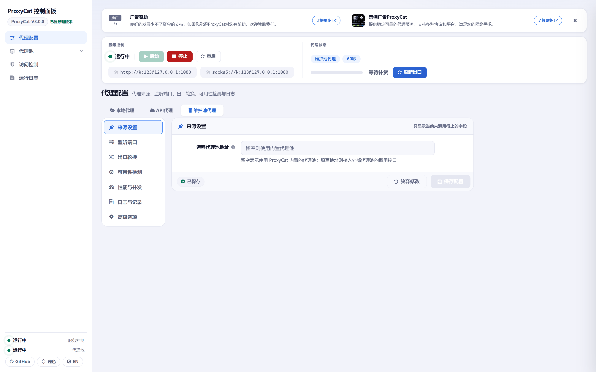
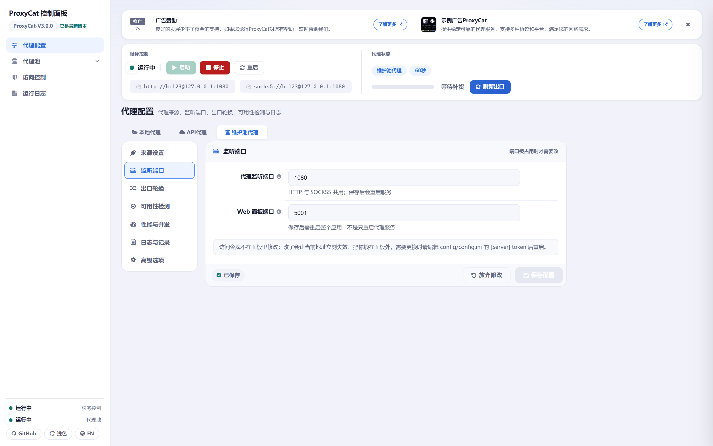
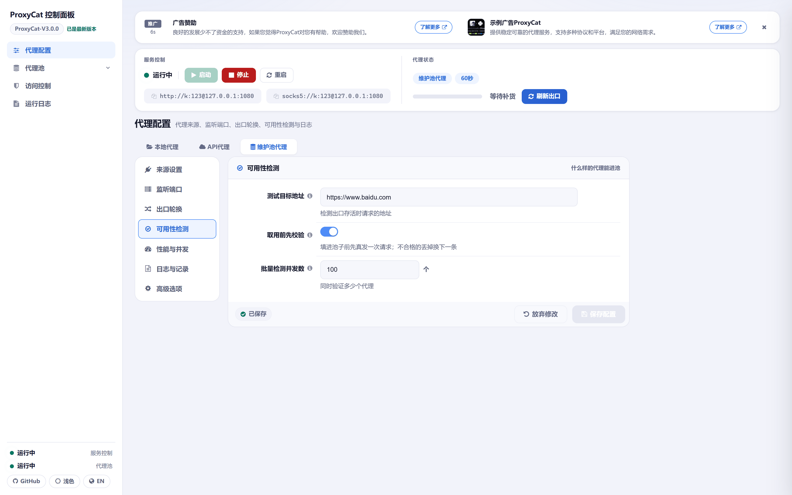
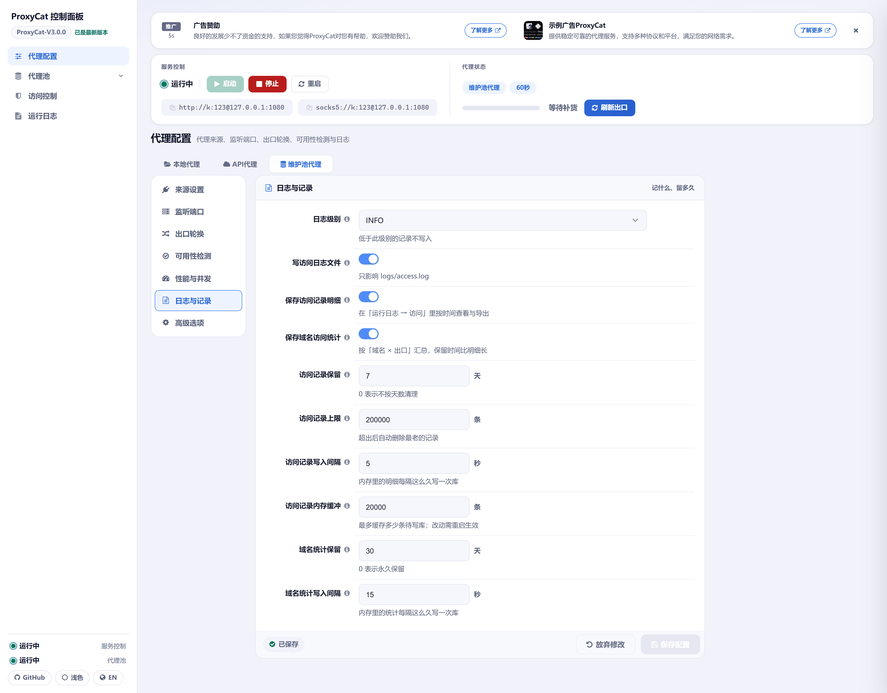
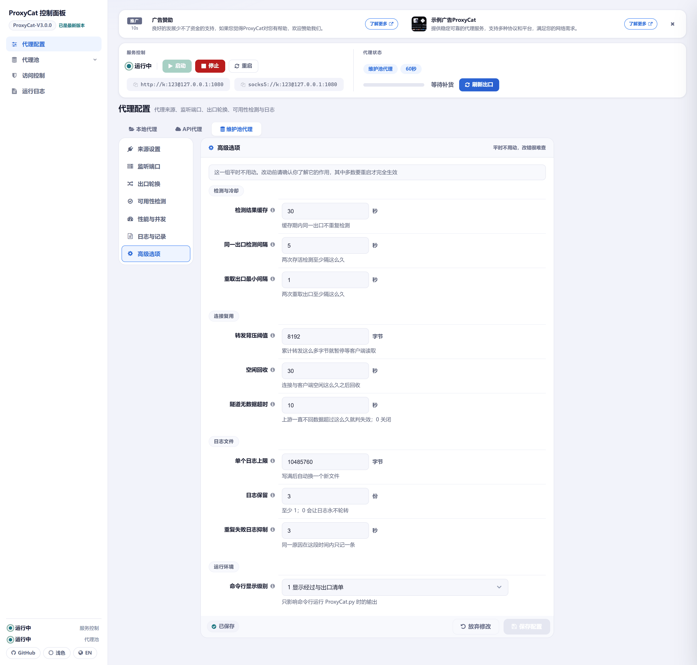
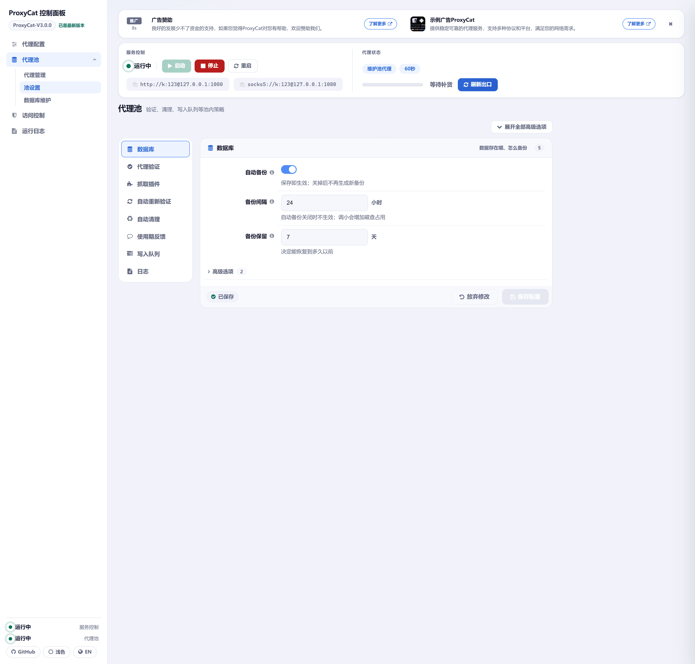
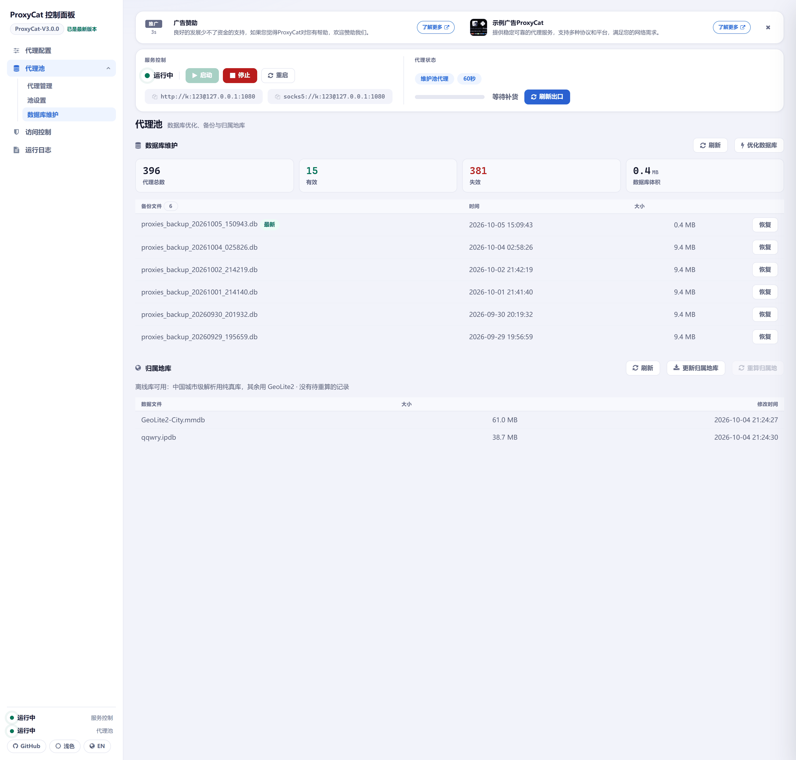

# ProxyCat 详细配置

[返回 README](../README.md) | [功能特性](Features.md) | [使用手册](Operation%20Manual.md) | [报错排查](Investigation%20Manual.md) | [更新日志](logs.md) | [接口文档](../API.md)

## 配置文件与权威参考

配置集中在 `config/config.ini`，分四段：

| 段 | 内容 |
|---|---|
| `[Server]` | 出口代理服务的全部参数：监听端口、轮换模式与间隔、代理来源、认证、名单文件、日志与统计开关等 |
| `[Users]` | 出口代理的 Basic 认证账号表 |
| `[api_credentials]` | 上游取代理接口的多套凭据，可在面板里切换当前生效的一套 |
| `[Pool]` | 代理池的全部参数，点号命名的键（如 `validator.timeout_seconds`） |

面板上的设置表单按同一口径分组：`[Server]` 的常用项在「代理配置」的七个组里直接可见，需要理解内部机制的调优项集中在「高级选项」组；`[Pool]` 的设置表单在每个组内折叠高级项。面板会记住上次查看的分组。

**权威参考有三处，优先级从高到低：**

1. **面板表单**（「代理配置」与「池设置」）—— 带校验，保存即生效，推荐日常使用。
2. **`config.ini` 的行内注释** —— 最全，每个键都有一句中文说明。
3. **`GET /api/pool/schema`** —— `[Pool]` 段的机器可读版（面板的「池设置」表单就由它渲染）。

这些配置项里有一批直接决定程序会往哪些外部地址发请求（例如 `test_url`、`api_proxy_url`、`pool_remote_url`、`validator.*_apis`、`validator.host_public_ip`），完整清单见 [功能特性里的「对外网络请求」](Features.md#对外网络请求)。

> 注：`config.ini` 里的注释是**中文**；面板里的字段说明才会按中英文分别渲染。

本页表格里的**「默认值」指程序内置默认**（键缺失、或整份 `config.ini` 被删掉时的取值）。随仓库发布的 `config.ini` 已按作者调优，下面这些项与内置默认不同：

| 配置项 | 内置默认 | 出厂 `config.ini` |
|---|---|---|
| `proxy_source_mode` | `local` | `pool` |
| `api_proxy_url` | `http://example.com/getip` | 空 |
| `mode` | `cycle` | `request` |
| `interval` | `300` | `60` |
| `exit_count` | `5` | `10` |
| `exit_wait_timeout` | `15` | `30` |
| `max_concurrent_requests` | `1000` | `3000` |
| `check_concurrency` | `50` | `100` |
| `switch_cooldown` | `2` | `1` |
| `proxy_check_ttl` | `60` | `30` |
| `check_cooldown` | `10` | `5` |
| `access_records_real_ip_probe` | `false` | `true` |
| `token` | 空（面板不校验） | `honmashironeko`，对外使用前必须换掉 |

> 按仓库自带的 `config.ini` 启动时，来源是 `pool` 且没有配置 `pool_remote_url`，**内置代理池会随服务自动启动** —— 这是出厂配置的正常行为，不是故障。

`[Pool]` 段的出厂值与内置默认一致，两边是同一份配置。

## 生效方式

| 方式 | 适用于 | 说明 |
|---|---|---|
| 即时 | 绝大多数 `[Server]` 与 `[Pool]` 项 | 面板保存后立即生效；手工改 `config.ini` 由后台巡检发现后热重载 |
| 需重启代理服务 | `port` | 端口只在服务启动时绑定；可以不动进程，在面板里重启一次代理服务即可按新端口生效 |
| 需重启整个应用 | `web_port`、`log_max_bytes`、`log_backup_count` | Web 端口在应用启动时绑定，不是只重启代理服务；日志轮转参数在启动装配 handler 时固定，面板保存与热重载都不会重建 handler |
| 需重启池服务或服务 | `database.path`、`database.pool_max_readers`（池服务）；`write_queue.max_queue_size`（服务）；`access_records_buffer_size`（调小时） | 资源在创建时就已固定，中途改要么不生效、要么会丢掉已排队的数据 |

**热加载的边界**（容易踩）：

- **从面板保存的配置即时生效**，两个入口都是。
- **手工编辑 `config.ini` 时**，两个入口都会重载 `[Server]` 段：`app.py` 有后台线程按秒巡检配置文件，`ProxyCat.py` 同样在状态轮询里发现改动后重载。
- `[Pool]` 段同样会热加载，两个入口都会在约 3 秒内生效。
- `port` 与 `web_port` 只在服务启动时绑定：`web_port` 改了必须重启整个应用（面板只在保存时给出告警）；`port` 可以不动进程，在面板里重启一次代理服务即可按新端口生效。

因此**不存在「每次改配置都要重启」这回事** —— 只有 `port`、`web_port` 这类启动时绑定的项需要重启，其余配置项无论从面板保存还是手工改 `config.ini`，都由上面的热重载生效。

## [Server] 配置项

`[Server]` 段在面板「代理配置」页里按用途分成七组，下面按同一分组列出全部键，每项的生效方式见表格末列。

### 来源设置

只显示当前来源用得上的字段。

图中为面板「代理配置 → 来源设置」组：顶部按钮切换代理来源，表单只渲染当前来源用得上的字段。

| 配置项 | 默认值 | 说明 | 生效方式 |
|---|---|---|---|
| `proxy_source_mode` | `local` | 代理来源：`local` 读 `proxy_file`；`api` 取 `api_proxy_url`；`pool` 用代理池。出厂 `config.ini` 是 `pool` | 即时 |
| `proxy_file` | `ip.txt` | `local` 来源的代理列表文件名；只取文件名（忽略路径部分），固定从 `config/` 目录读取；面板保存本地代理列表时会写回这个文件 | 即时 |
| `api_proxy_url` | `http://example.com/getip` | `api` 来源取代理地址的接口。接口返回按行解析：每行一条代理地址，未写协议的行按 http 处理，格式非法的行会被跳过 | 即时 |
| `proxy_username` | 空 | 拼接到取回的代理地址上的认证账号；与 `proxy_password` 都非空才生效，不用于接口本身（`api_proxy_url`）的认证 | 即时 |
| `proxy_password` | 空 | 与 `proxy_username` 成对使用；两者都非空时才为取回的地址附加认证 | 即时 |
| `pool_remote_url` | 空 | 外部代理池的**取用**接口地址：ProxyCat 只发一次 GET，把响应体每一行解析成代理地址，不做任何管理操作；`404` 表示暂时没有可用代理。留空表示使用进程内的代理池 | 即时 |

### 监听端口

端口被占用时才需要改。

图中为面板「代理配置 → 监听端口」组，另附一条说明：访问令牌不在这里修改。

| 配置项 | 默认值 | 说明 | 生效方式 |
|---|---|---|---|
| `port` | `1080` | 代理监听端口，HTTP 与 SOCKS5 共用（1-65535） | 需重启代理服务 |
| `web_port` | `5001` | Web 面板端口（1-65535）；改了必须重启整个应用，不是只重启代理服务 | 需重启整个应用 |
| `token` | 空 | Web 面板访问令牌，经 `?token=` 校验；留空表示面板不校验。面板**没有**这个入口 —— 改了会让当前地址立刻失效、把你锁在面板外，需要更换时编辑 `config.ini` 保存 | 改文件后热重载（约 1 秒），旧 token 随即失效 |

> **`token` 留空的风险**：留空时任何人只要连得上面板端口就能读写配置、查看访问记录，
> 也能拿到上游凭据。面板默认只应在本机使用；要暴露到网络上请务必设置 `token`。
> 另外，**仓库里自带的 `config.ini` 带了一个公开的默认 token**，对外使用前请换掉。

### 出口轮换

一个出口用多久、同时用几个。

图中为面板「代理配置 → 出口轮换」组：运行模式、两种寿命口径、在用出口数与无出口时的排队时长。

| 配置项 | 默认值 | 说明 | 生效方式 |
|---|---|---|---|
| `mode` | `cycle` | **同一个键在两种来源下问的是两件不同的事**。`local` 来源问「挑谁」：`cycle` 按清单顺序使用（忽略负载，前一条满了才用下一条）；`loadbalance` 谁压力小先用谁。`api` / `pool` 来源问「什么时候换」：`request` 触发更换 —— 只在收到新任务时取货、换出口，没有任务时到期的出口直接移除、池子会空掉，下一个请求到达时重新取货填满；`continuous` 持续更换 —— 与有没有流量无关，后台按寿命主动换掉到期的并补满。换来源时若当前值不属于新那一组，会自动归一到该组的默认值（列表中第一个）：`api` / `pool` 组的首项是 `request`（面板下拉里它同样排在前面），`local` 组的首项是 `cycle` | 即时 |
| `interval` | `300` | 每个出口的寿命上限（秒）：入池满这么久就被换掉。每个出口各自计时（就是「自己入池 + `interval`」，一批同时入池的因此同时到期），到期的**全部**更换，不是每隔这么久只换一个。所有来源、四种运行模式都生效（本地来源也按寿命轮换，换上来的是文件里的下一条；文件里没有备用条目时原地重开一次寿命）。**换的时机**由运行模式决定：持续更换在后台主动换，触发更换只在收到新任务时换、空闲时到期的直接移除。它与 `request_interval` 是**两条各自独立的规则，同时生效**，两个都填时谁先到谁换，不是二选一。`0` 表示不按时间计 | 即时 |
| `request_interval` | `0` | 每个出口的寿命上限（分配出去多少次后更换）：也是每个出口各数各的。数的是「分配次数」，一次请求用到它算一次，重试换到另一个出口会在那边再算一次。它与 `interval` 两条规则同时生效，谁先到谁换。`0` 表示不按请求数计 | 即时 |
| `exit_count` | `5` | 出口池的目标容量：`continuous`（持续更换）模式下即使空闲也由后台保持满员；`request`（触发更换，仓库出厂配置即此）与本地来源的取货、换新由请求驱动 —— 空闲约 10 秒后不再补货，到期的出口被移除而不是换新，池子可能空掉，下一个请求到达时才重新取货填满（池子空着或缺口挂着，下一个请求就要在请求路径上干等一次取货 + 校验）。取回后并发校验候补、逐槽填到满，某个出口失效就单独补上它，不整批替换。`api` / `pool` 每次按缺额超量取回（`min(缺额 × 8, 24)`），`api` 返回超出该上限的行会被截断丢弃；`local` 直接以文件为源、以本值为上限（文件不够就用多少算多少）。调小它，名册当场收回多余的（不等寿命）；每个出口一个客户端，调很大要留意连接与内存开销。出厂 `config.ini` 是 `10` | 即时 |
| `exit_wait_timeout` | `15` | 一个可用出口都没有时（刚启动、换来源、出口全被停用、取代理失败），请求排队等多久（秒）；等到有出口就照常服务，超时才回 `503`。填 `0` 表示不等、当场回 `503` | 即时 |

### 可用性检测

什么样的代理能进池。

图中为面板「代理配置 → 可用性检测」组：检测目标、启动检测与取用前校验、批量检测并发数。

| 配置项 | 默认值 | 说明 | 生效方式 |
|---|---|---|---|
| `test_url` | `https://www.baidu.com` | 代理存活检测的目标地址；代理池的 `validator.target_url` 也由它派生（「池设置」里没有这一项，改这里等于改池的验证目标） | 即时 |
| `check_proxies_on_startup` | `true` | 启动时是否先检测一遍代理可用性。以 `local` 来源启动服务时（两个入口都算），还会对当前名册做一次完整检测：不通的**逐个移出**、缺的交给补货。面板上的「检测代理」按钮检测的是**源清单**（`ip.txt` 里的全部条目），不是当前名册 | 即时 |
| `check_proxies_on_use` | `true` | 把候选填进出口池之前是否先校验一次（发一次真实请求）；不合格的丢掉换下一条。**不是按请求校验**：出口在服役期间失效靠失败淘汰兜底。来源给的地址可能一分钟就失效，端口开着不代表还能用 | 即时 |
| `check_concurrency` | `50` | 批量检测代理的并发数上限（1-1000）。出厂 `config.ini` 是 `100` | 即时 |

### 性能与并发

本机能同时扛多少请求。

图中为面板「代理配置 → 性能与并发」组：全局并发、单出口并发与自动扩容开关。

| 配置项 | 默认值 | 说明 | 生效方式 |
|---|---|---|---|
| `max_concurrent_requests` | `1000` | 同时处理的请求数上限，超出后在信号量上排队。它是全局信号量，对三类请求一视同仁，按「隧道」而不是「请求」估 —— 每出口额度之和远超它时，真正生效的是它。出厂 `config.ini` 是 `3000` | 即时 |
| `max_concurrent_per_proxy` | `0` | 单个上游出口的活跃连接上限；`0` 表示不限制。数的是「正在用」的连接：请求转发期间算，隧道建立后只有真的在传数据才算，空闲隧道不占额度（所以它是一道**准入控制**，不是「同时在挂的上游连接数」的硬上限）。总上游并发 ≈ 出口数 × 该值（受全局上限封顶）。上游按出口 IP 限流时，把它调成单 IP 能承受的并发数（例如 20），超出部分会排队而不是把上游打挂 | 即时 |
| `auto_expand_enabled` | `true` | 高峰期自动扩容出口池，两条触发路径：①**立刻** —— 监听端口上此刻挂着的连接数超过「在用出口数 × 单出口额度」时，当场把出口数翻倍（上限 2 倍）并一次补齐，不用等水位；②**兜底** —— 后台按「顶到单出口额度的出口占比」（八成持续 1 秒）逐格加出口。收回看「整池利用率」（一半以下持续 30 秒），阈值与时长固定在代码里、不开放配置。只在取回过货、拿到答复、却没有可用新候选时才放宽单出口额度（最多到 2 倍）；名册上限 = `max(exit_count, min(exit_count × 2, max_concurrent_requests))`。停止扩容后，多出来的出口**用满自己的寿命**才逐个撤下。`max_concurrent_per_proxy` 为 `0`（不限）时不扩，但已经张开的膨胀状态照常收回 | 即时 |

### 日志与记录

记什么、留多久。

图中为面板「代理配置 → 日志与记录」组：日志级别与访问日志、访问明细、域名统计三套开关及各自的保留口径。

| 配置项 | 默认值 | 说明 | 生效方式 |
|---|---|---|---|
| `log_level` | `INFO` | 日志级别：`DEBUG` / `INFO` / `WARNING` / `ERROR` / `CRITICAL`。成功访问行是 `INFO`，级别调到 `WARNING` 及以上会把它们过滤掉（面板会就地提示） | 即时 |
| `log_access_enabled` | `true` | 是否把每次代理访问写进访问日志（`logs/access.log`）。关闭后不再写这个文件，域名统计与访问记录明细都不受影响 | 即时 |
| `access_records_enabled` | `true` | 是否逐条记录每一次代理请求（面板「运行日志」页的访问明细，落在 `logs/access_records.db`）。与访问日志文件、域名统计是两个独立的记录去向，开关互不影响 | 即时 |
| `access_records_real_ip_probe` | `false` | 出口地址是网关时，经它探测一次真实出口 IP（仅 `api` 来源；每个地址多消耗一次代理流量）。代理池来源直接用池里已验证的出口 IP，本地代理不探测。出厂 `config.ini` 是 `true` | 即时 |
| `domain_stats_enabled` | `true` | 是否按「域名 × 上游代理」累计访问统计（面板「运行日志」页的访问统计） | 即时 |
| `access_records_retention_days` | `7` | 逐条记录的保留天数；`0` 表示不按时间清理 | 即时 |
| `access_records_max_rows` | `200000` | 逐条记录的行数上限，超出后裁掉最旧的；`0` 表示不限制 | 即时 |
| `access_records_flush_interval` | `5` | 逐条记录的落库间隔（秒） | 即时 |
| `access_records_buffer_size` | `20000` | 逐条记录的内存缓冲条数，超出后丢最旧的并计数；调小需重启生效 | 调小需重启 |
| `domain_stats_retention_days` | `30` | 访问统计的保留天数；`0` 表示不清理 | 即时 |
| `domain_stats_flush_interval` | `15` | 访问统计的落库间隔（秒） | 即时 |

### 高级选项

平时不用动，改错很难查。

图中为面板「代理配置 → 高级选项」组：各项冷却、缓存与内部机制相关的调优项都在这里。

| 配置项 | 默认值 | 说明 | 生效方式 |
|---|---|---|---|
| `proxy_check_ttl` | `60` | 代理可用性检测结果的缓存有效期（秒）。出厂 `config.ini` 是 `30` | 即时 |
| `check_cooldown` | `10` | 两次可用性检测之间的冷却时间（秒）。出厂 `config.ini` 是 `5` | 即时 |
| `switch_cooldown` | `2` | 重取出口批次后的冷却时间（秒）；冷却内不再重取（补货也受它限流）。对三种来源一视同仁。出厂 `config.ini` 是 `1` | 即时 |
| `buffer_size` | `8192` | 明文 HTTP 转发累计多少字节就施加一次背压（等客户端把数据读走），最小 1024。它**不控制切块大小** —— 响应体按上游交付的原生块（通常 64 KiB）转发，不做重切；隧道中继固定 64 KiB，也不受这一项影响 | 即时 |
| `client_keepalive_expiry` | `30` | 空闲回收（秒）：保活连接空闲这么久就失效；装这些连接的客户端按同一个时间回收（它不该比连接活得短）。调小会让刚预热好的连接被丢掉、连接复用变差 | 即时 |
| `tunnel_idle_timeout` | `10` | 隧道建立后「客户端发过数据、上游一个字节都没回」持续多久判为上游装死（秒）；`0` 表示不判。这是发现「收下 CONNECT 后不回数据」的**唯一手段**，但上游只是排队很慢时也会命中 —— 上游在高并发下响应普遍超过这个值，就把它调大 | 即时 |
| `log_max_bytes` | `10485760` | 单个日志文件的大小上限（字节），超出后轮转 | 需重启整个应用 |
| `log_backup_count` | `3` | 轮转后保留的历史文件份数；至少 1（`0` 会让日志永不轮转） | 需重启整个应用 |
| `proxy_failure_cooldown` | `3` | 故障告警的折叠窗口（秒）：同一类告警在窗口内只写一条日志，并记下被折叠了多少条。高并发下失败是成批来的，不折叠日志会被同一句话刷满。折叠**只发生在日志层**，出口的记账与调度不受影响（那套看的是近期失败占比，不靠计时器） | 即时 |
| `display_level` | `1` | 控制台详细程度：`0` 仅显示出口名册变化与错误信息；`1` 显示出口名册、各出口状态、倒计时与错误信息；`2` 显示所有详细信息（`2` 与 `3` 的行为逐条相同，填 `3` 会被归一成 `2`）；`2` 会在启动横幅后附上各级别说明。只影响命令行运行 `ProxyCat.py` 时的输出 | 即时（仅作用于命令行入口的输出） |

### 访问控制与界面语言

这几个键不在「代理配置」页的七个分组里：黑白名单与绕过名单的设置在面板「访问控制」页，语言切换在侧边栏底部。

| 配置项 | 默认值 | 说明 | 生效方式 |
|---|---|---|---|
| `whitelist_file` | `whitelist.txt` | 客户端 IP 白名单文件名；只取文件名，固定从 `config/` 目录读取 | 即时 |
| `blacklist_file` | `blacklist.txt` | 客户端 IP 黑名单文件名；只取文件名，固定从 `config/` 目录读取 | 即时 |
| `ip_auth_priority` | `whitelist` | 同时命中黑白名单时的判定优先级：`whitelist`（放行）/ `blacklist`（拦截） | 即时 |
| `bypass_whitelist_file` | `bypass_whitelist.txt` | 绕过名单文件名：命中的目标地址直连、不经过上游代理（支持通配符），不做拦截判断；只取文件名，固定从 `config/` 目录读取 | 即时 |
| `language` | `cn` | 界面与提示语言：`cn` / `en`。语言是**服务端设置**（写回 `config.ini`）：切换后面板文案、接口错误文案、导出文件的表头一起变；命令行入口的控制台横幅只在启动时打印一次，不会跟着重印 | 即时 |

## [Users]

出口代理的 Basic 认证账号表：键为用户名、值为密码，一行一个账号；整段为空表示代理不要求认证。

| 配置项 | 默认值 | 说明 | 生效方式 |
|---|---|---|---|
| `用户名 = 密码`（如 `neko = 123456`） | 内置默认没有 `[Users]` 段，不要求认证 | 请求需带 Basic 认证，不带认证的请求会得到 `407`。仓库自带的 `config.ini` 里有两个账号：`k = 123` 与 `neko = 123456` | 面板「访问控制 → 用户管理」保存即时生效 |

建议通过面板的用户管理维护 —— 面板保存会直接更新运行中的服务；手工编辑本段也会随配置热重载被读到。

## [api_credentials]

上游取代理接口的多套凭据，由面板「代理配置 → 来源设置（API 来源）」里的凭据管理维护，可一键切换当前生效的一套。

| 配置项 | 默认值 | 说明 | 生效方式 |
|---|---|---|---|
| `credential_sets` | `[]` | 可用的取 IP 凭据集合，JSON 数组，每项为 `{"name", "url", "username", "password"}`；手改本行必须保持为合法 JSON，否则整份凭据都读不出来 | 面板保存即时生效 |
| `active_credential` | 空 | 当前启用的凭据名，须与 `credential_sets` 中某一项的 `name` 完全一致；不一致时视为未选用 | 面板保存即时生效 |

## [Pool] 配置项

`[Pool]` 段的键用点号命名。修改后保存即可热生效，无需重启；也可以直接通过面板的「代理池 → 池设置」页修改 —— 两边是同一份配置。下面的分组顺序与「池设置」页一致，由 `GET /api/pool/schema` 驱动。

图中为面板「代理池 → 池设置」页：下面八个分组的表单都在这一页里。

### 数据库

数据存在哪、怎么备份。

图中为面板「代理池 → 数据库维护」页：数据库统计与优化、备份列表与恢复、离线归属地库的更新与重算。

| 配置项 | 默认值 | 说明 | 生效方式 |
|---|---|---|---|
| `database.path` | `data/proxies.db` | 代理池所有数据存放的文件（SQLite 格式）。填相对路径时以 `modules/proxypool/` 目录为起点。库在启动时就已经打开 | 需重启池服务 |
| `database.pool_max_readers` | `4` | 同时查询数据库的连接数上限，写入固定只占 1 个连接。调大能让并发查询更顺畅，也会多占用一些文件句柄；池子不大时保持默认即可 | 需重启池服务 |
| `database.backup_enabled` | `true` | 是否按下面的间隔自动备份数据库；保存后立即生效（关掉即停，重新打开即起） | 即时 |
| `database.backup_interval_hours` | `24` | 自动备份的间隔（小时） | 即时 |
| `database.backup_retention_days` | `7` | 备份文件保留多少天，超期自动删除 | 即时 |

### 代理验证

什么样的代理算可用。

| 配置项 | 默认值 | 说明 | 生效方式 |
|---|---|---|---|
| `validator.check_anonymity` | `true` | 是否检查代理的匿名度。匿名度靠「目标站点实际收到了哪些请求头」判定，只在经代理发一次明文请求时才测得出来；关掉后不再发这类请求、也不再判匿名度，已经测出来的等级原样保留 | 即时 |
| `validator.host_public_ip` | 空 | 本机公网出口 IP，判定「透明代理」时的对比基准。双栈主机两族各填一个、用逗号隔开（IPv4 与 IPv6 各至多一个），两族都会参与比对；只填一个也能用。留空时 ProxyCat 会**不经过代理**直接访问 IP 查询站点获取（每 30 分钟最多一次，成功与失败都重新计时）；填上你自己的出口 IP 可以完全免掉这次对外请求。留空或拿不到时无法判定匿名度，那一项会保持原样 | 即时 |
| `validator.timeout_seconds` | `5` | 验证一个代理最多等多少秒，超过就判为不可用。所有探测请求都按这个上限 | 即时 |
| `validator.connect_timeout_seconds` | `2.0` | 连接代理最多等多少秒。失效的代理大多卡在连不上这一步，调小它可以明显加快整批验证；填 `0` 表示不单独限制，只受上面的总超时约束 | 即时 |
| `validator.max_concurrent` | `400` | 同时验证多少个代理。每次验证连的是不同主机，可以放心调高；同时它也决定本机连接池上限与可打开的 socket 数（一次验证会并发发出十几个请求），受限环境应调低；如果测试站点开始限流（表现为大量代理突然超时），也调低一些。另外，存活探测阶段的排队超时算「不下结论」、不写任何字段；存活通过之后并发发出的身份与明文探测若因本机连接池排队超时，会被记成一次失败样本、拉低健康分的成功率维度 —— 所以它不是越高越好 | 即时 |
| `validator.identity_echo_apis` | `https://httpbin.org/anything, https://httpbingo.org/anything, https://eu.httpbin.org/anything` | 用来探测出口 IP 和匿名度的接口，多个用英文逗号分隔，必须是 https。这类接口要能返回 origin 与 headers，一次请求就能同时得出出口 IP、匿名度和 HTTPS 支持情况。连不上的会被自动跳过；可用的按直连延迟排序后逐个补发竞速，不按条数截断，多写的留作替补 | 即时 |
| `validator.plain_identity_echo_apis` | `http://postman-echo.com/get` | 补充的明文回显接口，多个用英文逗号分隔，必须是 http。匿名度靠「目标实际收到了哪些请求头」判定，明文路径是它的标准观测面，默认用的是上面几个接口的明文地址。如果代理够不到那些站点、导致匿名度总被判成兜底档，可以把代理能访问的回显站点填在这里 | 即时 |
| `validator.ip_check_apis` | `https://icanhazip.com, https://checkip.amazonaws.com, https://api.ip.sb/ip, https://realip.cc/simple, https://httpbin.org/ip, https://api.ipify.org, https://ipinfo.io/json, https://ipwho.is/, https://www.cloudflare.com/cdn-cgi/trace` | 只返回 IP 的接口，多个用英文逗号分隔，必须是 https。上面的接口都拿不到结果时用它们兜底，同样按直连延迟逐个补发竞速，不按条数截断 | 即时 |

### 抓取插件

多久去各来源抓一次。

| 配置项 | 默认值 | 说明 | 生效方式 |
|---|---|---|---|
| `plugins.scan_interval_seconds` | `60` | 多久检查一次有没有插件该抓取了（秒）。它只决定检查的频率，不改变各插件自己的抓取周期 | 即时 |
| `plugins.default_interval_minutes` | `60` | 新插件默认多久抓取一次（分钟）。每个插件都可以单独调整自己的周期；这一项只影响之后新建的插件 | 即时 |
| `plugins.execution_timeout_seconds` | `300` | 单个插件一次抓取最多跑多少秒，超时就中断 | 即时 |
| `plugins.request_timeout_seconds` | `30` | 插件请求一次网页最多等多少秒；目标站点打不开时按这个时间等待 | 即时 |
| `plugins.max_parallel_plugins` | `3` | 最多同时运行几个插件 | 即时 |
| `plugins.max_retries_on_failure` | `2` | 插件抓取失败后额外重试几次。填 `2` 表示最多一共尝试 3 次 | 即时 |
| `plugins.retry_base_delay_seconds` | `10.0` | 插件失败后重试前等待的秒数。每多试一次等待翻倍（第 1 次等 1 倍、第 2 次 2 倍、第 3 次 4 倍），避免短时间内反复打同一个站点 | 即时 |

### 自动重新验证

失效的代理怎么被发现。

| 配置项 | 默认值 | 说明 | 生效方式 |
|---|---|---|---|
| `auto_revalidation.enabled` | `true` | 是否定时重新检查已入库的代理还能不能用 | 即时 |
| `auto_revalidation.interval_minutes` | `360` | 默认多久重新检查一遍（分钟）。每个插件可以在「插件管理」里单独设置自己的周期 | 即时 |
| `auto_revalidation.only_valid_proxies` | `true` | 只检查当前可用的代理，跳过已经判定失效的 | 即时 |
| `auto_revalidation.run_on_start` | `true` | 启动后马上先检查一遍，而不是等满一个周期 | 即时 |
| `auto_revalidation.full_recheck_interval_minutes` | `1440` | 多久做一次完整检测（分钟）。日常检查只看代理还通不通；出口 IP、匿名度、协议支持这些信息很少变，隔较长时间重新测一遍即可 | 即时 |

### 自动清理

什么样的代理会被删掉。

| 配置项 | 默认值 | 说明 | 生效方式 |
|---|---|---|---|
| `auto_cleanup.enabled` | `true` | 是否自动删除质量太差的代理。删除不可恢复，拿不准时先关掉它只做检查 | 即时 |
| `auto_cleanup.min_health_score` | `10.0` | 健康分低于这个值的代理会被删除，同时还要满足下一条的次数要求 | 即时 |
| `auto_cleanup.min_checks_before_cleanup` | `3` | 至少检查过多少次才允许按评分淘汰，避免刚入库的代理因为样本太少被误删 | 即时 |
| `auto_cleanup.max_failures` | `3` | 连续失败这么多次就删除 | 即时 |
| `auto_cleanup.max_age_days_if_invalid` | `3` | 判定失效后最多再保留几天，超过就删除 | 即时 |

### 使用期反馈

转发失败算不算数。

| 配置项 | 默认值 | 说明 | 生效方式 |
|---|---|---|---|
| `use_feedback.enabled` | `true` | 代理在实际转发中不通时，是否把它记为一次失败并在连续失败达阈值后标记失效。检测分不清「代理坏了」和「我们自己网络抖动」，阈值就是用来吃掉后者的；关掉后池只信自己的验证结果 | 即时 |
| `use_feedback.invalid_threshold` | `3` | 连续失败这么多次就标记失效，期间任何一次成功都会清零 | 即时 |

### 写入队列

记录攒多少再落库。

| 配置项 | 默认值 | 说明 | 生效方式 |
|---|---|---|---|
| `write_queue.batch_size` | `100` | 攒够多少条记录才一次性写进数据库 | 即时 |
| `write_queue.max_retries` | `3` | 一批记录最多尝试写几次（含第一次）。填 `0` 或 `1` 都表示失败就放弃 | 即时 |
| `write_queue.max_queue_size` | `10000` | 等待写入的任务最多排多少个。排满后新任务会被拒绝，以免占用过多内存。队列容量在创建时固定，中途改会丢掉已排队的数据 | 需重启服务 |

### 日志

日志写多大、留几份。

| 配置项 | 默认值 | 说明 | 生效方式 |
|---|---|---|---|
| `logging.file_path` | `logs/proxy_pool.log` | 代理池的日志文件。填相对路径时以 `modules/proxypool/` 目录为起点 | 即时 |
| `logging.max_bytes` | `10485760` | 单个日志文件的大小上限（字节）。写满后自动换一个新文件，旧文件继续保留 | 即时 |
| `logging.backup_count` | `5` | 最多保留几个历史日志文件 | 即时 |

## 面板不展示的配置项

下面四个键仍写在 `config.ini` 里，但面板不再展示；实际取值由当前运行参数推算：

| 配置项 | 默认值 | 实际取值 |
|---|---|---|
| `client_max_connections` | `1000` | `max(本值, 单出口并发上限 × 2)`；单出口不限并发（`max_concurrent_per_proxy` 为 `0`）时退回全局并发上限 |
| `max_pool_size` | `500` | `max(本值, 名册数 × 2, 出口数 × 4)` —— 按当前名册与扩容上限推算，低于推算值时本值被忽略 |
| `client_max_keepalive` | `8` | 直接使用本值 |
| `client_idle_timeout` | `300` | 由 `client_keepalive_expiry` 推出，取 `max(它, 30)`；面板不读取本值，写回时按推导值覆盖 |

几点说明：

- `client_max_connections` 设小了会把请求闷进 httpx 连接池排队；`max_pool_size` 低于推算值时，每个出口的客户端会互相淘汰，连接复用就没了。两者的值高于推算值时照常生效，留在这里只为了兼容老配置里调大过的值。
- `client_max_keepalive` **不要调大**：httpx 的连接池在分配请求时会对空闲连接做一遍全池扫描（httpcore 1.0.9 的实现），空闲连接越多，每个请求花在这上面的 CPU 越多 —— 实测池里空闲连接几十条时它就能吃掉单核的一半以上，吞吐掉到三分之一。压小这一项（连接用完就关、用时再建）实测在有无上游延迟两种场景下都更快；真要让单个出口扛更多并发，调 `client_max_connections` 而不是这一项。
- `client_idle_timeout` 是客户端的连接池空闲多久后回收（秒），由 `client_keepalive_expiry` 推算，手改的值会被推导值覆盖，留在这里只为了兼容老配置。
