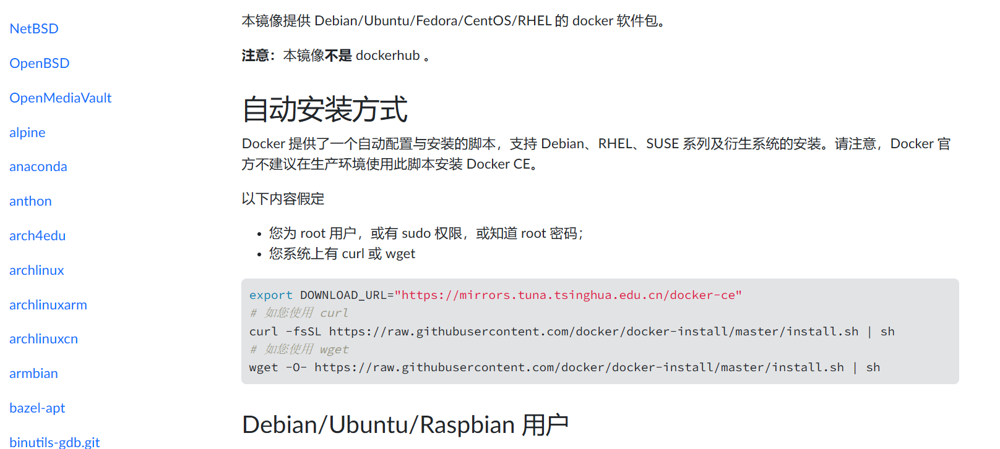

# ProxyCat 使用手册

## 源码使用及 Docker 部署

### 源码手册

**Windows&Mac**：浏览器访问位于 Github 的源码存储库并下载：[ProxyCat](https://github.com/honmashironeko/ProxyCat)


**Linux**：通过 Git 方法拉取项目到本地

```
git clone https://github.com/honmashironeko/ProxyCat.git
```


安装 Python 依赖（**请尽量保证Python版本为3.8-3.11**）

```
pip install -r requirements.txt
# 或使用国内源：
pip install -r requirements.txt -i https://pypi.tuna.tsinghua.edu.cn/simple/
```

进入 config 文件夹内找到 config.ini 配置文件，按照自己拥有的资源选择不同的代理服务器获取方法

1️⃣如果您的代理服务器地址为固定的连接，不需要动态更换，可以使用本地 ip.txt 的方式提供格式如下所示

```
# 支持 http/https/socks5 三种代理服务器地址
socks5://127.0.0.1:7890
https://127.0.0.1:7890
http://127.0.0.1:7890
...
```

2️⃣如果您是通过 API 方式获取代理地址，可以在 config.ini 中修改配置（配置后不再读取 ip.txt）

```
# config.ini 配置文件中将以下两条配置进行修改
use_getip = True
getip_url = 获取代理地址的 API 接口
# 请注意，API 接口所获取的代理地址必须为 IP:PORT 格式且只提供一条地址，如果格式不同请到 getip.py 脚本中修改代码，如果您需要指定协议（默认为socks5）可以进入 getip.py 脚本中修改
```

当您配置完成之后就可以运行工具了

```
python ProxyCat.py
```


### Docker 手册

Windows 可以下载 Docker 官方工具：[Docker Desktop](docs.dockerd.com.cn)


Linux 可以通过清华大学源提供的脚本一键安装：[清华大学安装脚本](https://mirrors.tuna.tsinghua.edu.cn/help/docker-ce/)



安装完成后请测试docker、docker-compose是否安装成功，如果安装失败请百度

Windows&Linux 进入 ProxyCat 文件夹下（**在此之前请根据源码手册中 config.ini 配置部分完成参数修改**）运行以下命令进行部署

```
# 进入ProxyCat文件夹中并构建镜像和启动容器
docker-compose up -d --build

# 停止服务和启动服务（每次修改完配置后需要重启服务）
docker-compose down | docker-compose up -d

# 查看日志信息
docker logs proxycat
```

## 问题Q&A

Q：为什么运行后我的XXX工具代理还是没换？
A：ProxyCat 并不是全局代理工具，需要XXX工具支持使用代理，将流量发送到 ProxyCat 的本地监听端口才会进过代理池。


Q：为什么倒计时结束后代理没有更换？

A：ProxyCat 为了节约硬件资源和代理服务器资源，特意修改运行逻辑为有流量经过的时候才会更换代理，这样可以减少资源的浪费，同时可以部署一次，长期可用。


Q：为什么我用 getip 方式获取代理地址的时候，首次运行会报 None ，没有可用的代理地址？

A：为了防止资源浪费，通过 getip 获取的情况一般是付费购买静态短效IP，运行就获取的话会浪费大量资源从而导致资金损耗，为避免这种情况发生，首次运行不会主动获取，您只需要正常使用发包，ProxyCat 会自动获取并发送。


Q：为什么我会遇到 XXX 报错？为什么不能用？
A：可先看《排查手册》，无法修复的情况下可以找作者询问，提问前请先支付50元作为时间的购买费用，如果您的问题属于百度可查或手册中有的，费用将不会返还；如果属于工具BUG或功能建议，费用将全额返还并将您列入本项目的感谢名单中。（实在是太多人多在问一些非常简单且写在帮助中的问题，时间被极大的浪费了，同时有很多态度非常恶劣的人，这不是我所想要的） 
