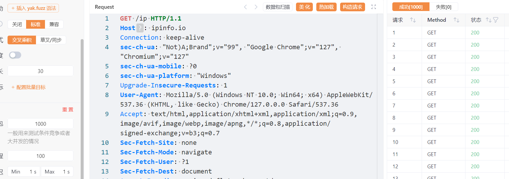
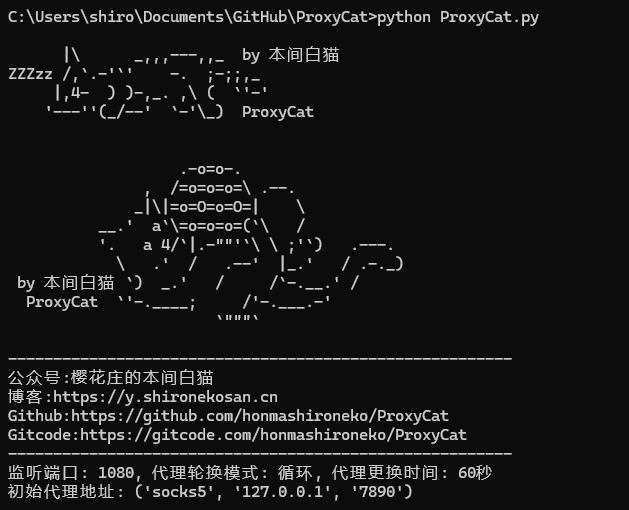
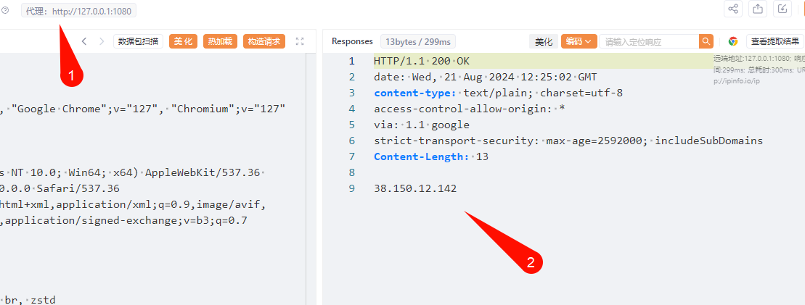
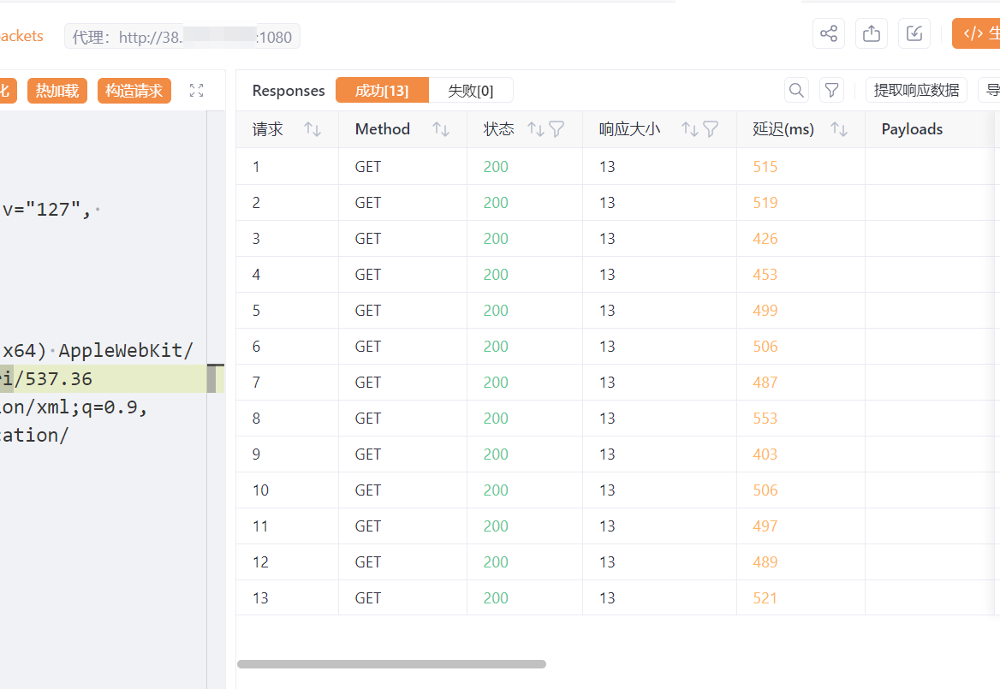

## 一、工具概述

渗透过程中总是遇到需要隐藏IP地址或者更换IP地址绕过安全设备的情况，但是市面上的隧道代理价格极其昂贵，普遍在20-40元/天，这高昂的费用令人难以接受。但是笔者注意到短效IP其实性价比很高，一个IP只需要几分钱，平均只需要0.5-3元/天。

综上所述，本工具应运而生！目的是在于将持续时间仅有1分钟-60分钟不等的短效IP转变成一个固定IP供其他工具使用，形成代理池服务器，部署一次即可永久使用。


辛苦各位给本项目，以及作者其他开源项目都点点star，您的star对作者非常重要！也希望您帮忙多多分享本工具。

## 二、安装依赖库

`pip install -r requirements.txt`

如果pip安装速度慢，可以采用国内源进行安装：

`pip install -r requirements.txt -i https://pypi.tuna.tsinghua.edu.cn/simple/`

## 三、工具使用

按照该格式`socks5://127.0.0.1:7890` or` http://127.0.0.1:7890` 一行一个填入ip.txt文件中。

如果您缺少合适的代理地址，恰巧又有几块钱的话可以联系作者（微信公众号：樱花庄的本间白猫），获取多家低价代理购买地址，（后续会编写全自动代理更换）为作者带来几毛钱的推荐收益~

本工具参数如下所示：

```
# python3 ProxyCat.py -h
      |\      _,,,---,,_  by 本间白猫
ZZZzz /,`.-'`'    -.  ;-;;,_
     |,4-  ) )-,_. ,\ (  `'-'
    '---''(_/--'  `-'\_)  ProxyCat

用法: ProxyCat.py [-h] [-p P] [-m M] [-t T]

参数:
  -p P        监听端口
  -m M        代理轮换模式:cycle 表示循环使用,once 表示用完即止
  -t T        代理更换时间(秒)
 举例：python3 ProxyCat.py -p 1080 -m cycle -t 180
 效果：监听1080端口 代理轮换模式为循环使用 每180秒更换到下一个代理地址
```

当前经过实际测试，在代理地址服务器性能足够的情况下，能够做到100并发不丢包，基本可以覆盖大部分扫描和渗透测试。



## 四、工具演示

本地环境运行使用方法：





远程服务器运行使用方法：



## 五、免责申明

1. 如果您下载、安装、使用、修改本工具及相关代码，即表明您信任本工具
2. 在使用本工具时造成对您自己或他人任何形式的损失和伤害，我们不承担任何责任
3. 如您在使用本工具的过程中存在任何非法行为，您需自行承担相应后果，我们将不承担任何法律及连带责任
4. 请您务必审慎阅读、充分理解各条款内容，特别是免除或者限制责任的条款，并选择接受或不接受
5. 除非您已阅读并接受本协议所有条款，否则您无权下载、安装或使用本工具
6. 您的下载、安装、使用等行为即视为您已阅读并同意上述协议的约束

## 六、开发计划

- [ ] 增加代理服务器身份鉴别功能，保证在公网使用过程中不被恶意盗用

- [ ] 增加每次请求更换IP功能

- [ ] 增加静态代理自动获取更新模块，从而永久运行

  如果您有好的idea，或者使用过程中遇到的bug，都请辛苦您添加作者联系方式进行反馈！

  微信公众号：樱花庄的本间白猫

## 七、更新日志

**2024/08/21**

1. 工具首次发布

## 八、赞助开源

开源是免费的，全靠爱的力量！但是还是希望您在觉得工具不错的情况下，赞助一下作者的开发哦~


顺便打个广告：[各大运营商流量卡](https://172.lot-ml.com/ProductEn/Index/0b7c9adef5e9648f)

[](https://star-history.com/#honmashironeko/ProxyCat&Date)
